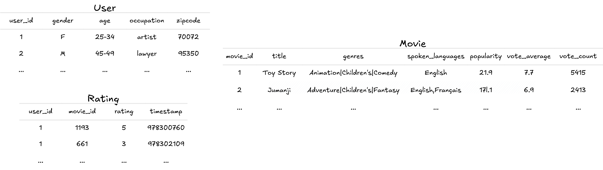
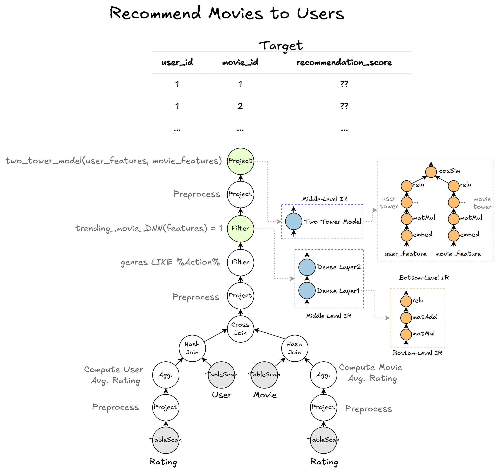

# CactusDB Early Release for VLDB Submission

**Note:** This is an early release of the CactusDB codebase for VLDB reviewers. An official release will be available soon.

CactusDB is a UDF-centric database built on top of Meta's high-performance database engine, [Velox](https://github.com/facebookincubator/velox). It enables the co-optimization of SQL queries nested with model inference.

- [CactusDB Early Release for VLDB Submission](#cactusdb-early-release-for-vldb-submission)
  - [Getting Started](#getting-started)
    - [Dependencies](#dependencies)
    - [Set-Up Through Docker](#set-up-through-docker)
    - [Compile CactusDB](#compile-cactusdb)
    - [Data and Models](#data-and-models)
  - [Example](#example)
    - [Two-Tower-based Recommendation Workloads](#two-tower-based-recommendation-workloads)
    - [Run on Baselines](#run-on-baselines)
    - [Run on CactusDB](#run-on-cactusdb)
  - [Other Workloads](#other-workloads)
    - [Run Baselines](#run-baselines)
    - [Run CactusDB](#run-cactusdb)
  - [Development Guide](#development-guide)
  - [FAQ](#faq)
  - [License](#license)


## Getting Started

### Dependencies

The following dependencies are required to run CactusDB and other baselines:

- LibTorch (LibTorch_CUDA)
- PostgreSQL
- EvaDB
- tokenizers-cpp
- Spark
- Eigen
- Catch2
- h5cpp
- cpr
- xgboost
- hadoop
- Madlib
- PostgresML

To manually install the dependencies, please refer to [this file](/INSTALL_DEPENDENCIES.md) for more details.

> **Note:** Some paths of the loaded data are hard-coded for the Docker environment. Please modify these paths as necessary when running the code. We are currently working on refactoring this.


### Set-Up Through Docker

We recommend using the provided Dockerfile to set up the environment. See the [Docker setup guide](/docker-doc/README.md) for more details. Alternatively, you can manually install the dependencies by following the instructions [here](/INSTALL_DEPENDENCIES.md). CactusDB has been tested and supports Linux (x86) and macOS (Apple Silicon). For Windows users, we recommend using Docker with Windows Subsystem for Linux (WSL).

### Compile CactusDB

After configuring all the dependencies, you can compile CactusDB by following these commands:

```bash
# Run Velox setup-ubuntu to install other dependencies
./scripts/setup-ubuntu.sh
# Compile Velox in release mode
make release
# Install Python libraries for baselines
pip install -r db-ml/baseline/requirements.txt
# Compile CactusDB at the root folder
make release
```

**Note:** If you are using an ARM chip, you need to set `CPU_TARGET="aarch64"` before running setup-ubuntu.sh.

### Data and Models

Run the following commands to download the datasets and models used in our paper. The resources will be extracted into the `resources` directory.

```bash
pip install gdown -U
gdown 1Fpb_jGpkxb7d5ZBC8Uqnq25uEgfOc7yV
unzip resources.zip -d resources
```

## Example

### Two-Tower-based Recommendation Workloads

Dataset Schema:


Query:
The following figures shows the query tree of Q1 in the MovieLens Recommendation workloads.


### Run on Baselines

The implementation of baselines is located under the [db-ml/baseline](/db-ml/baseline/). Ensure all dependencies are installed, including those listed in `requirements.txt`.

```bash
cd db-ml/baseline
# Load the MovieLens datasets into the Postgres
python load_data_to_db.py --dataset=movielens_recommendation
# Run recommendation workloads on baselines.
python benchmark_movielens.py
```

### Run on CactusDB

After compiling the CactusDB, `cd _build/release/velox/optimizer/tests`. You can run the with, without optimization, or abalation study by using the following commands.
```bash
# set the optimization type by setting the CD_VELOX_QUERY_OPT_TYPE variable, with following options:
# CD_VELOX_QUERY_OPT_TYPE= : w/o optimization
# CD_VELOX_QUERY_OPT_TYPE=mlq1-ffnn_pushdown_n_reorder : pushdown the trending movie dnn
# CD_VELOX_QUERY_OPT_TYPE=mlq1-fusion: fuse the ML kernels
# CD_VELOX_QUERY_OPT_TYPE=mlq1-optimized : final optimized plan
export CD_VELOX_QUERY_OPT_TYPE=XXX
./ablation_study_test -mode=ablation -model=ml-q1
```

## Other Workloads

### Run Baselines

The implementation of baselines is located under the [db-ml/baseline](/db-ml/baseline/). Ensure all dependencies are installed, including those listed in `requirements.txt`.

Before running the baseline benchmarks for different workloads, load the data into the datastore by executing the following command:

```bash
cd db-ml/baseline
# Specify the dataset you want to load with the parameter: dataset, or pass 'all' to load all data.
python load_data_to_db.py --dataset=XX  # tpcxai, movielens_recommendation, etc.
```

We have developed several benchmark scripts to run different workloads. For example, you can run all the baselines on the MovieLens recommendation workloads using the following command:

```bash
python benchmark_movielens.py
```

You can configure the baselines by modifying the `benchmark_movielens.py` file. For more details on the benchmark scripts, refer to the [baseline README](./db-ml/baseline/README.md).

For more detailed instructions, refer to the [baseline README](/db-ml/baseline/README.md).

### Run CactusDB

To run other workloads on CactusDB, please refer to the [**this file**](./velox/optimizer/tests/README.md).

## Development Guide

Please check [this file](/DEVELOP_GUIDE.md) to see the supported ML kernels and how to implement the pipeline within CactusDB. Other functions/APIs can be checked through [**this link**](https://asu-cactus.github.io/CactusDB_Doc/annotated.html)

## FAQ

- **If Spark/Hadoop is not started, run the following commands:**
  ```bash
  service ssh start
  start-all.sh
  ```

- **The compilation is killed and used all the resources:**
  Please try to reduce the number of threads if the compilation takes all the memory and gets killed.
  ```bash
  export NUM_THREADS=4
  ```


## License

CactusDB is licensed under the Apache 2.0 License, the same as Velox. You can find a copy of the license [here](LICENSE).

<!-- TODO -->


